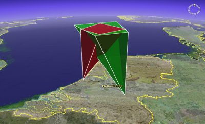

# Field of view visualization using 3D GIS software (FOV3D)

To get a better understanding of the atmospheric volume that is monitored by a (meteor) camera, one may use 3D GIS-software such as Google Earth to interactively explore the field of view of a camera. To do this, we created a PHP-script called "FOV3D". The script generates a 3D semi-transparant polygon representing the field of view of a given camera.

The script produces output in the KML-format, which is an XML-based language for describing geospatial data. KML-files can be imported into GIS-software such as Google Earth, NASA World Wind and ArcGIS. However, the files generated by this script have only been verified to work with Google Earth.

## Original code
FOV3D was written by Geert Barentsen, the source code was downloaded from this [ESA website](https://www.cosmos.esa.int/web/meteor/fov3d).
